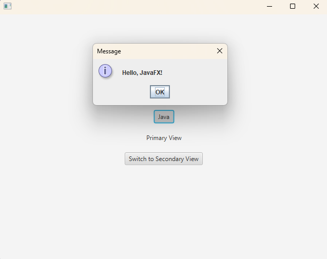
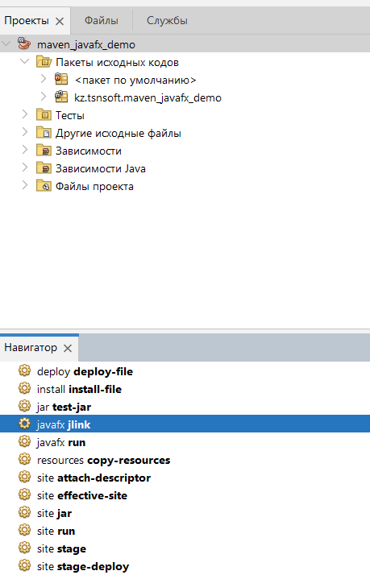
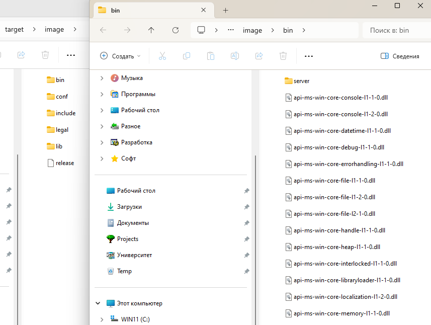

# MAVEN_JAVAFX_DEMO_2024
**Пример программы с JavaFX на Java для NetBeans 21, со сборщиком Maven**



## Опции Maven для сборки проекта:

***Создание портативного автономного образа программы с JRE (javafx jlink):***



***Пример файлов готового портативного образа программы с JRE:***



__Для запуска программы нужно поместить в папку bin готового образа файл "start_javafx_jlink_image.bat" с 
таким содержимым:__

```
echo off
set MODULE=kz.tsnsoft.maven_javafx_demo
set PACKAGE=%MODULE%
set CLASS=App
@start /b java -m %MODULE%/%PACKAGE%.%CLASS%
```
это оболочка для команды:

```
java -m kz.tsnsoft.maven_javafx_demo/kz.tsnsoft.maven_javafx_demo.App
```